# BAKALAR-BOOKING-APP

## Introduction:

This web application is a booking system for a restaurant, created with django and bootstrap. This project uses CRUD functionality to give users the options to create, read, update and delete their bookings, also including a small menu section and a contact section where the user can find information of interest about the restaurant.

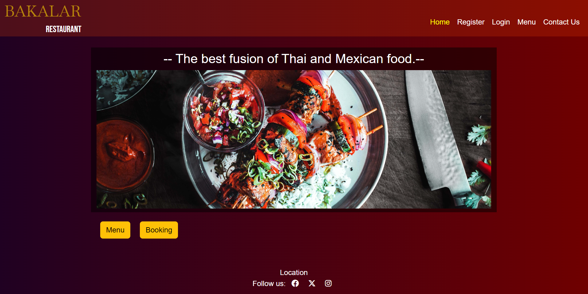

Visit the deployed website [here](https://bakalar-booking-app-f4bee72469cb.herokuapp.com/).

## Table of Contents

- [BAKALAR-BOOKING-APP](#bakalar-booking-app)
  - [Introduction:](#introduction)
  - [Table of Contents](#table-of-contents)
  - [User Experience (UX)](#user-experience-ux)
    - [Project Goals](#project-goals)
    - [User Stories](#user-stories)
    - [Strategy Table](#strategy-table)
  - [Scope](#scope)
    - [Phase 1](#phase-1)
    - [Phase 2](#phase-2)
  - [Structure](#structure)
    - [Database model](#database-model)
    - [Colour Scheme](#colour-scheme)
    - [Typography](#typography)
    - [Wireframes](#wireframes)
  - [Features](#features)
    - [General](#general)
    - [Home Page](#home-page)
    - [Register Page](#register-page)
    - [Edit User Page](#edit-user-page)
    - [Login and Logout](#login-and-logout)
    - [Menu](#menu)
    - [Booking Page](#booking-page)
    - [Check Your Bookings Page](#check-your-bookings-page)
    - [Edit Bookings](#edit-bookings)
    - [Contact Us](#contact-us)
    - [Forbidden Page](#forbidden-page)
  - [Technologies Used](#technologies-used)
    - [Languages Used](#languages-used)
    - [Frameworks, Libraries and Programs Used](#frameworks-libraries-and-programs-used)
  - [Testing](#testing)
    - [Testing User Stories](#testing-user-stories)
    - [Code Validation](#code-validation)
    - [Accessibility](#accessibility)
    - [Tools Testing](#tools-testing)
    - [Manual Testing](#manual-testing)
  - [Deployment](#deployment)
  - [Credits](#credits)
    - [Content](#content)
    - [Media](#media)
    - [Code](#code)
  - [Acknowledgements](#acknowledgements)

***

## User Experience (UX)

We all have booked a table at a restaurant at some point and being able to do so through a web service should not be an unpleasant experience. For this reason, my project aims to give the user a clear vision of the options available at all times, trying to offer the most complete service possible when booking a table.

### Project Goals

- Responsive design to make the website accessible on different screen sizes.
- Well structured website and easy to navigate.
- Provide security in access to user data and their bookings.
- Allows CRUD functionality for bookings.

### User Stories

Throughout the project I used the GitHub projects board to log all user stories. I used an AGILE perspective to manage the user stories inside my github project. 

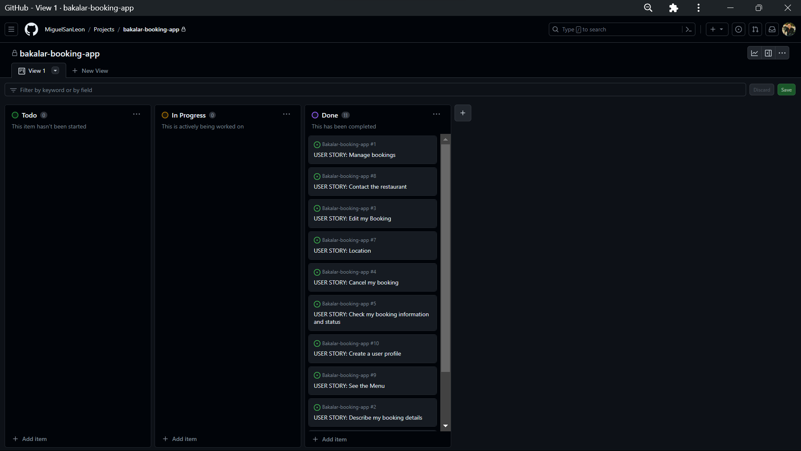

- USER STORIE 1: As a Admin I can manage the bookings so that I can all the data provided by the user and accept the bookings.
- USER STORIE 2: As a User I can select time, date, number of guests and add comments to my booking so that I describe my booking details properly.
- USER STORIE 3: As a User I can edit my booking so that I can change the date, time, number of guests or add a comment.
- USER STORIE 4: As a User I can delete my booking from the website so that I can cancel it.
- USER STORIE 5: As a User I can view my booking so that I can check my booking details and status.
- USER STORIE 6: As a User I can book a table in the website so that I don't need to call the restaurant for a booking.
- USER STORIE 7: As a User I can see the correct restaurant address so that I could find the exact location of the restaurant, the better route and the estimated time of arrival.
- USER STORIE 8: As a User I can navigate to contact page so that I can have the restaurant address and contact details.
- USER STORIE 9: As a User I can see the restaurant menu so that I can decide to book a table or not.
- USER STORIE 10: As a User I can create a user profile so that I can login to book a table.
- USER STORIE 11: As a user I can edit my user profile so that I can update my data on the website.
  
### Strategy Table
Opportunity/Problem/Feature| Importance| Viability/Feasibility
------------ | -------------------------|---------
Responsive design | 5 | 5
Display restaurant Menu | 5 | 5
Account registration | 5 | 5
User profile | 5 | 5
Create a booking | 5 | 5
Update a booking | 5 | 5
Cancel a booking | 4 | 4
Contact form | 3 | 4
Avoid double bookings | 4 | 1
Booking acceptance email | 3 | 1

Total | 44 | 40

## Scope

 As all features can't be implemented in the first release of the project, the project will be divided in two phases. The first phase will include the features that have been identified in order to build the minimum viable product.

### Phase 1

* Responsive design 
* Account registration
* User profile
* Display restaurant Menu
* Create a booking
* Update a booking
* Cancel a booking

### Phase 2

* Contact form
* Avoid double bookings
* Booking acceptance email
* Account email verification
* Social media signup

## Structure

### Database model

This is the database scheme first model:
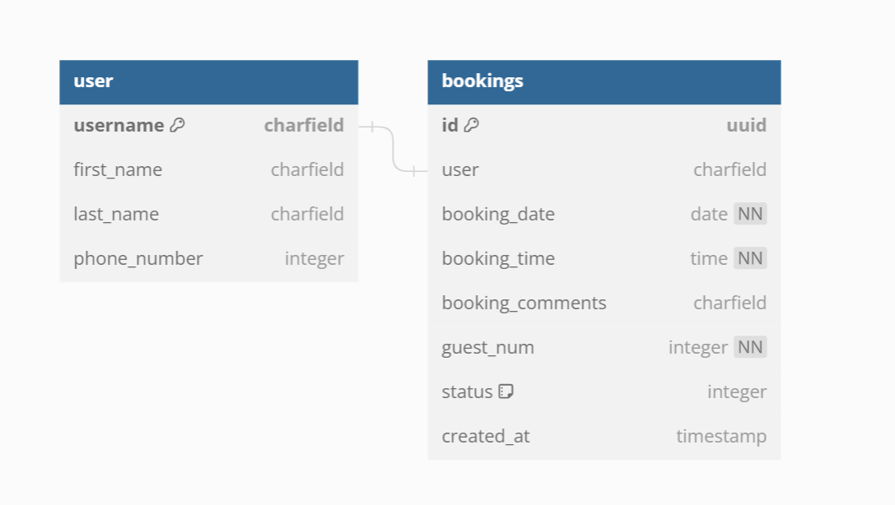

And this is the final database structure:
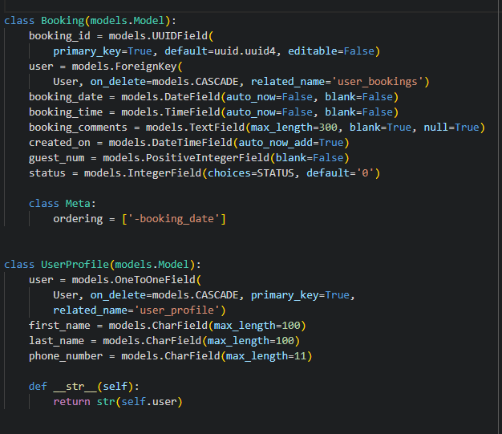

### Colour Scheme

I decided to use a gradient background from [Uigradients](https://uigradients.com/)
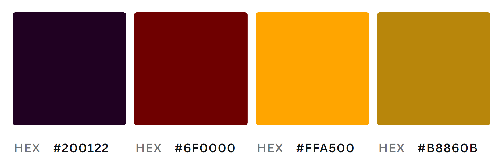

### Typography

I chose 2 fonts for this project, Baskerville and Bebas Neue with sans serif as fallback font for both.

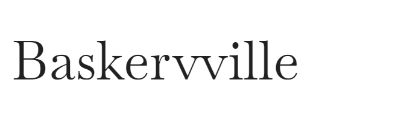
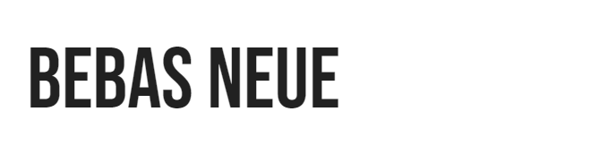

This fonts can be found [here](https://fonts.google.com/)

### Wireframes

[Balsamiq](https://balsamiq.com/) has been used to create all the wireframes for desktop and mobile views for this project.

Page | Desktop Version | Mobile Version
--- | --- | ---
Landing page/user logout | 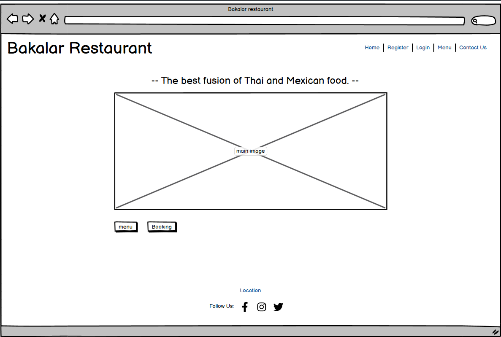 | 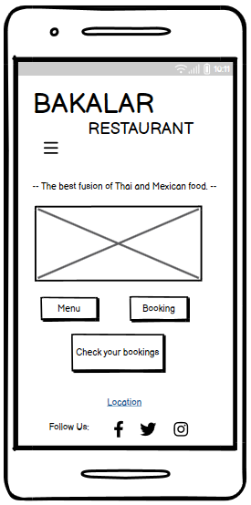
Landing page/ user login | 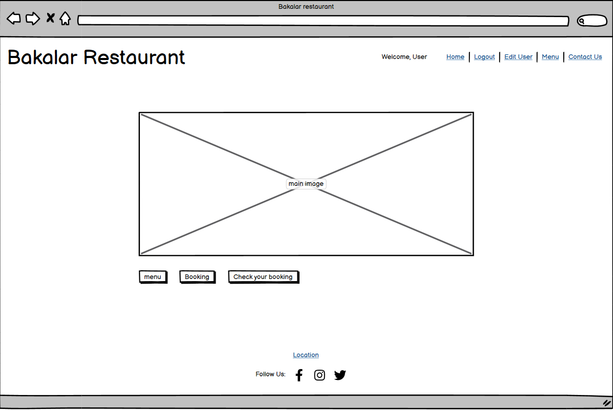 | 
Sign up page | 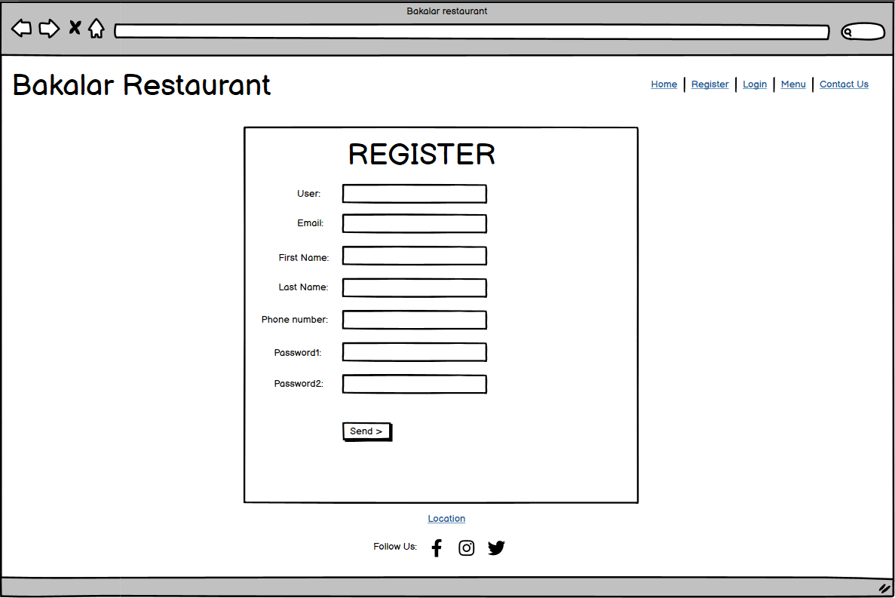 | 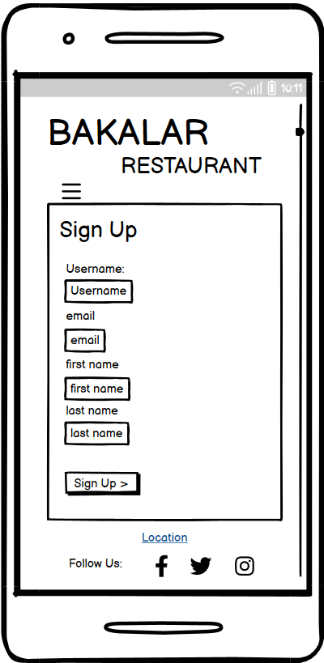

## Features

### General

### Home Page

### Register Page

### Edit User Page

### Login and Logout

### Menu

### Booking Page

### Check Your Bookings Page

### Edit Bookings

### Contact Us

### Forbidden Page

## Technologies Used

### Languages Used

### Frameworks, Libraries and Programs Used

## Testing

### Testing User Stories

### Code Validation

### Accessibility

### Tools Testing

### Manual Testing

## Deployment

## Credits

### Content

### Media

### Code

## Acknowledgements
